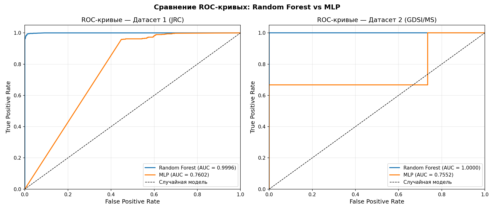
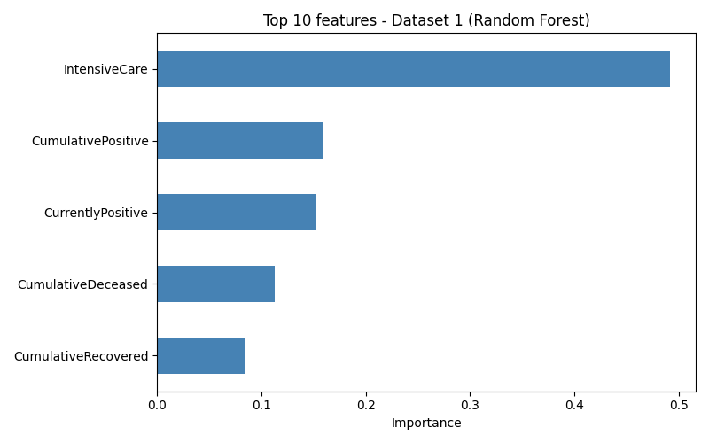
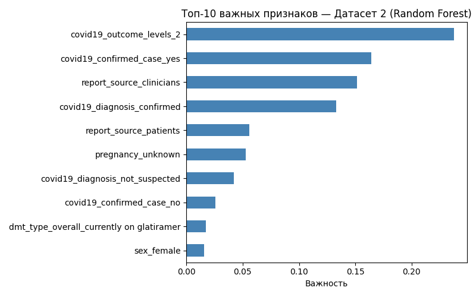
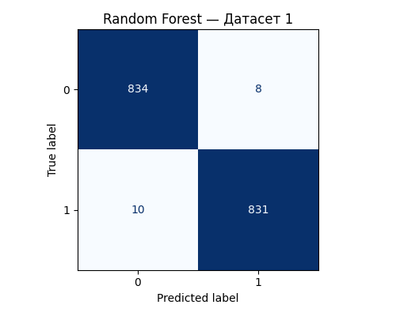
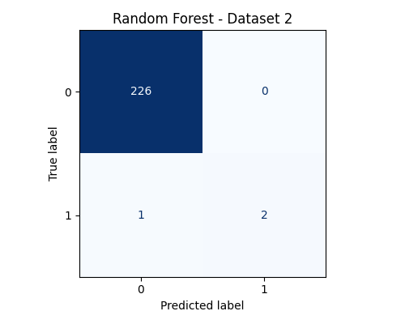

# COVID-19 Hospitalization Prediction

ML project comparing Random Forest and MLP classifiers to predict COVID-19 hospitalization risk, using two real-world datasets.

*Bachelor's thesis project, written during correspondence studies at Chuvash State University.*

## Datasets

- **JRC (Joint Research Centre, European Commission)** — daily country-level COVID-19 statistics: identification fields (date, country), epidemiological indicators (cumulative cases, deaths, recoveries), and healthcare load indicators (hospitalizations, ICU occupancy). Used to model healthcare system burden at a country level.
- **GDSI (MS Global Data Sharing Initiative)** — clinical data on 1,141 multiple sclerosis patients who had COVID-19: demographics, disease characteristics (MS type, disability level), comorbidities, and COVID-19 outcome severity. Used to model individual patient-level risk.

Both datasets required substantial preprocessing: handling missing values (forward/backward fill for time-dependent country data, mode/median imputation for clinical features), encoding categorical variables, and addressing severe class imbalance (only 1.3% of GDSI patients were hospitalized) using SMOTE.

## Results

| Dataset | Model | Accuracy | Precision | Recall | F1 | AUC-ROC |
|---|---|---|---|---|---|---|
| JRC | Random Forest | 0.9893 | 0.9905 | 0.9881 | 0.9893 | 0.9996 |
| JRC | MLP | 0.7142 | 0.6393 | 0.9822 | 0.7745 | 0.7461 |
| GDSI | Random Forest | 0.9956 | 1.0000 | 0.6667 | 0.8000 | 1.0000 |
| GDSI | MLP | 0.9825 | 0.4000 | 0.6667 | 0.5000 | 0.7552 |

**Random Forest consistently outperformed MLP on both datasets.** On JRC, it correctly classified nearly all 1,683 test observations (only 8 false positives and 10 false negatives). MLP, in contrast, showed high recall but low precision, it tends to over-predict hospitalization, likely because neural networks are less suited to small tabular datasets compared to ensemble tree methods.

*Note on GDSI's AUC = 1.0000: the test set contained only 3 true hospitalization cases out of 229 patients. Random Forest correctly identified 2 of the 3 (Recall = 0.6667) with zero false positives (Precision = 1.0000), a strong result, but one that should be read with the small positive-class size in mind rather than as evidence of a generally "perfect" model.*

**Feature importance** was clinically interpretable in both cases: ICU load (`IntensiveCare`) was the most influential feature for the JRC model, while outcome severity was the key driver for the GDSI model.

## Visualizations

## Tech Stack

Python · scikit-learn · pandas · NumPy · SMOTE · matplotlib

## Repository Structure

- `preprocessing.py` — data cleaning, imputation & SMOTE balancing
- `model_training.py` — Random Forest & MLP training
- `roc_kurves.py` — ROC curve generation
- `cm_df1_rf.png`, `cm_df1_mlp.png` — confusion matrices, JRC
- `cm_df2_rf.png`, `cm_df2_mlp.png` — confusion matrices, GDSI
- `feature_importance_df1.png`, `feature_importance_df2.png` — feature importance
- `roc_curves.png` — ROC curves

## Author

Stefaniia Ivanitskaia

